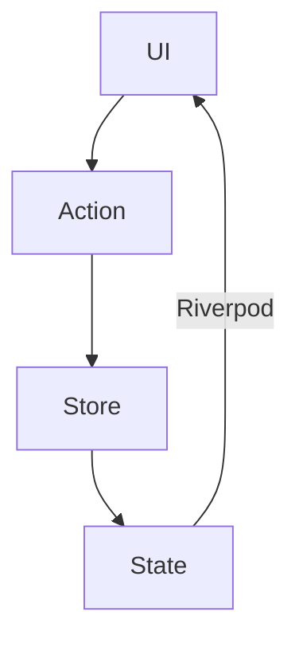

## アーキテクチャ構成
**Clean Architecture + Redux**  
※ 厳密にはReduxのReducerを無くしたシンプルな構成

**選定理由**
- FlutterがViewがStateを見るように設計されていて、ReduxやFluxのような設計と相性が良さそうだった
- Stateが変化すればViewが変化するので、ViewModelのようなデータバインディングが不要である
- 単一方向の設計にした方が、データの流れが掴みやすい
- 今回はStateが1つしかないのでReduxで良さそう

### 各層の責務
 1. Entity層: ドメインモデルの定義
 2. Services層: 外部API呼び出し、データの変換
 3. Action層: 状態変更の意図を表現（Reduxパターン）
 4. Store層: 状態管理、ビジネスロジック
 5. Screens層: UI表示、ユーザーインタラクション
 6. Extension層: 既存クラスの機能拡張

## 状態管理
### Reduxパターンの採用
```dart
void dispatch(WeatherAction action) {
  switch (action) {
    case FetchWeatherAction():
      _fetchWeather(action.city, action.date);
    case FetchWeatherSuccessAction():
      _fetchWeatherSuccess(action.weatherForecast);
    case FetchWeatherErrorAction():
      _fetchWeatherError(action.error);
  }
}
```

### データフロー


1. **UI**でユーザーアクション発生
2. **Action**をdispatch
3. **Store**で状態変更処理
4. **State**が更新される
5. **Riverpod**がUIに変更を通知
6. **UI**が再描画される

 ```mermaid
flowchart TB
  subgraph Arrows
    direction LR
    start1[ ] -..->|read| stop1[ ]
    style start1 height:0px;
    style stop1 height:0px;
    start2[ ] --->|listen| stop2[ ]
    style start2 height:0px;
    style stop2 height:0px;
    start3[ ] ===>|watch| stop3[ ]
    style start3 height:0px;
    style stop3 height:0px;
  end
  subgraph Type
    direction TB
    ConsumerWidget((widget));
    Provider[[provider]];
  end

  weatherStoreProvider[["weatherStoreProvider"]];
  MainScreen((MainScreen));

  weatherStoreProvider ==> MainScreen;
  weatherStoreProvider --> MainScreen;
  weatherStoreProvider -.-> MainScreen;
```